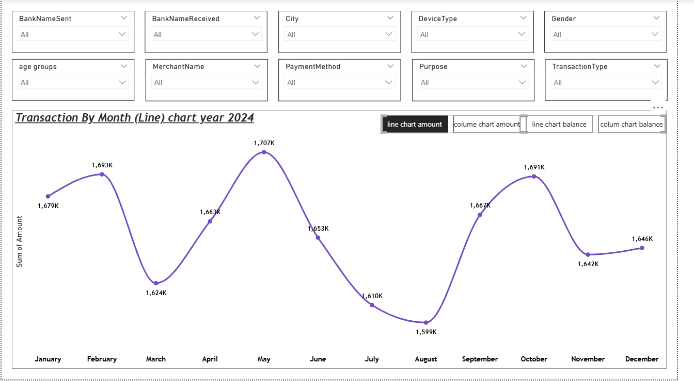
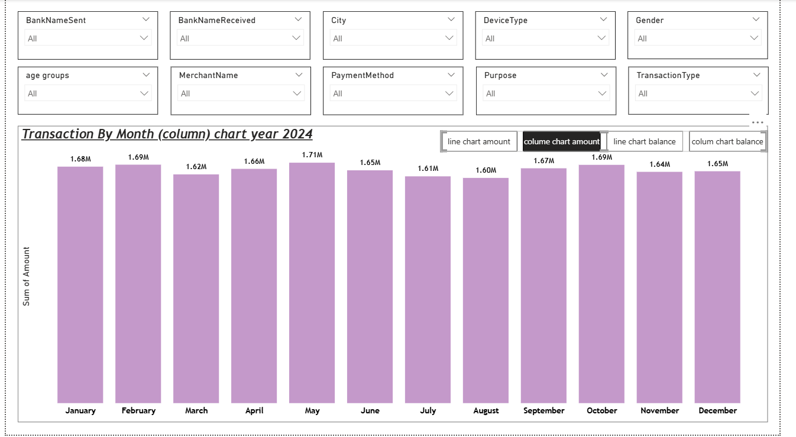
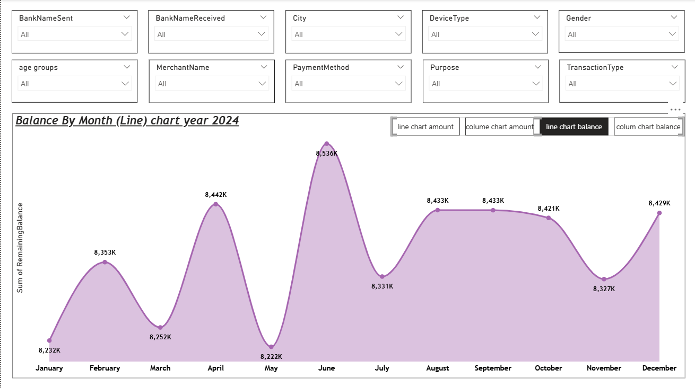
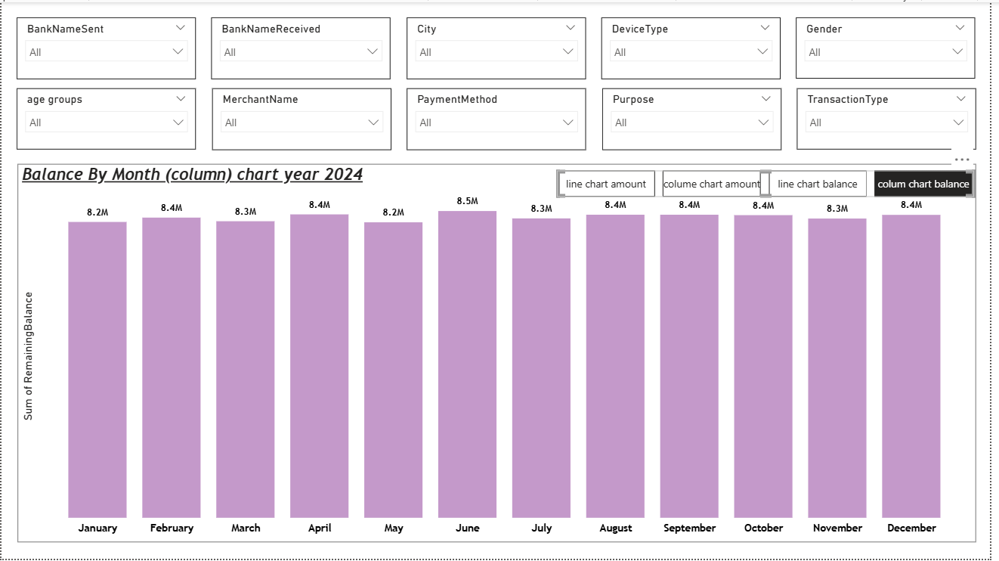
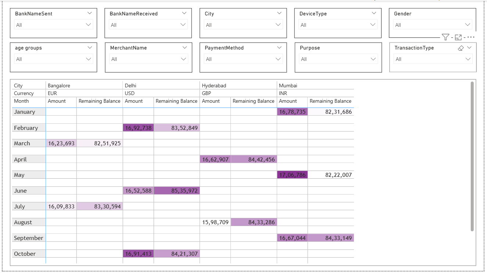

# UPI project

This project is an interactive Power BI dashboard designed to analyze financial transactions and balances for the year 2024. It allows users to explore monthly trends in transaction amounts and remaining balances, with the flexibility to filter data by bank, city, device type, gender, age group, merchant, payment method, purpose, and transaction type.
The dashboard helps stakeholders quickly identify seasonal patterns, anomalies, and customer behavior, enabling better decision-making for financial institutions, merchants, and analysts

# UPI-Dashboard

https://app.powerbi.com/groups/me/reports/335f564e-c513-4443-9202-06c0db897bce/2c97a89254d0a25d2570?experience=power-bi

## Problem Statement

This dashboard helps financial institutions, merchants, and analysts understand transaction and balance trends across demographics, devices, and payment methods.
It provides:
- Monthly transaction totals (Amount).
- Monthly remaining balances.
- Comparative analysis across cities, currencies, and customer attributes.
By identifying peaks, troughs, and seasonal variations, organizations can optimize operations, detect anomalies, and improve customer experience.

### Steps followed 

- Steps Followed
- Step 1: Loaded transactional dataset into Power BI Desktop (CSV/Excel format).
- Step 2: Used Power Query Editor → enabled Column distribution, Column quality, Column profile.
- Step 3: Selected column profiling based on entire dataset for accurate validation.
- Step 4: Checked for nulls/errors → minimal missing values in Amount/Balance columns.
- Step 5: Created visuals:
- Line chart (Transaction Amount by Month).
- Column chart (Transaction Amount by Month).
- Line chart (Balance by Month).
- Column chart (Balance by Month).
- Step 6: Added slicers for:
- BankNameSent, BankNameReceived, City, DeviceType, Gender, Age groups, MerchantName, PaymentMethod, Purpose, TransactionType.

# Snapshot of Dashboard (Power BI Service)

# Insights

Insights
- Transaction Trends (2024)
- Peak transaction months: May (1.71M) and October (1.69M).
- Lowest transaction months: March (1.62M) and August (1.60M).
- Balance Trends (2024)
- Balances remain stable between 8.2M – 8.5M.
- Highest balance: June (8.5M).
- Lowest balance: May (8.2M).
- City & Currency Analysis
- Mumbai (INR) shows consistent high transaction volumes.
- Delhi (USD) maintains strong balances across months.
- Hyderabad (GBP) dips in August.
- Bangalore (EUR) fluctuates moderately
- Demographic Insights
- Age groups segmented into 0–25, 25–50, 50–75, 75–100.
- Gender, DeviceType, and PaymentMethod filters allow deeper behavioral analysis.

#Conclusion
This dashboard provides a comprehensive view of financial transactions and balances across multiple dimensions. It enables stakeholders to:
- Detect seasonal patterns.
- Compare city/currency performance.
- Monitor customer behavior by demographics.
- Make data-driven decisions for operational efficiency

